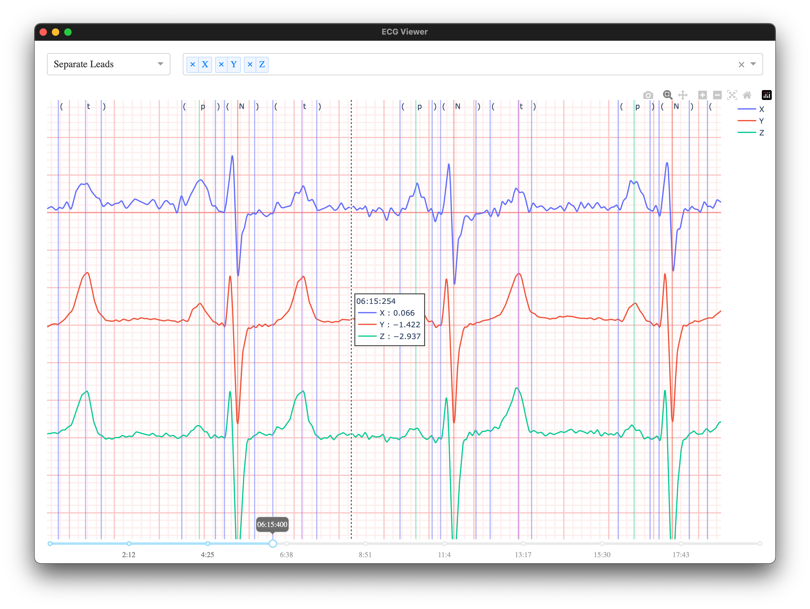

# ECG Viewer

A small app to view [MIT-BIH](https://github.com/wfdb/wfdb-spec/) waveform data and annotations.

## How to Use
- Download the latest version of this application from the [Releases](https://github.com/Ivorforce/ECG-Viewer/releases) page.
- Double click the executable.
- In the menu bar, select **Load Record...**. Select both the `.hea` and `.dat` file.
- If desired, in the menu bar, select **Load Annotations...**.
- Interact with the GUI as follows: 
  - Adjust the window to make the ECG legible. If an appropriate height cannot be achieved, use the scroll wheel to look at the remaining leads.
  - Select the filter to use for data display. The filters are all bidirectional, 2nd order butterworth filters.
  - Select whether to separate the leads vertically ("Separate Leads") or stack them on top of each other ("Stacked Leads").
  - Select the leads to show in the graph.
  - Select the appropriate time using the time slider.
  - Hover over individual leads to read the values.
  - If desired, zoom and pan into the graph to discern details.
  - Click the 'screenshot' button to save the current graph as a screenshot.

Please [report an issue](https://github.com/Ivorforce/ECG-Viewer/issues) if you find any or encounter problems.

## How to Modify
- Install [python poetry](https://python-poetry.org/docs/).
- `poetry install`
- `poetry run python src/ecgviewer/main.py`

## Known Issues
- In separate leads mode, the values shown on hover for the leads are incorrect.
- When a filter is used, the values shown on hover are for filtered values, not the original.

## In the Wild

See how I'm using this template with a more advanced project in [ECG Viewer](https://github.com/Ivorforce/ECG-Viewer/tree/main).
